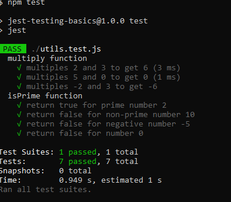

# Jest Testing Basics

## Objective

Gain hands-on experience with Jest by setting up a Node.js environment for unit testing. Create specific utility functions, write tests to validate their functionality, and ensure your code adheres to best practices in testing.

## Setup Process

- Clone repository:
  ````bash
  git clone github-repository-url
  cd jest-testing-basics```
  ````
- Initialize Node.js Project:

```bash
npm init -y
```

- Install dependencies:

```bash
npm install --save-dev jest
```

- Add test script:

```json
"scripts": {
  "test": "jest"
}
```

## Running Tests

Run the following command in git bash:

```bash
npm test
```

## Utility Functions

### multiply(a,b)

Returns the multiplication of `a` and `b`.

Examples:

- `multiply(2,3)` returns `6`
- `multiply(0, 5)` returns `0`
- `multiply(-2, 3)` returns `-6`

### isPrime(number)

Checks if `number` is a prime number.

Examples:

- `isPrime(2)` returns `true`
- `isPrime(10)` returns `false`
- `isPrime(-5)` returns `false`
- `isPrime(0)` returns `false`

## Testing

- `multiply` function tests include normal multiplication, multiplying by zero, and negative numbers.
- `isPrime` function tests include prime numbers, non-prime numbers, and negative input.

### Test Results


